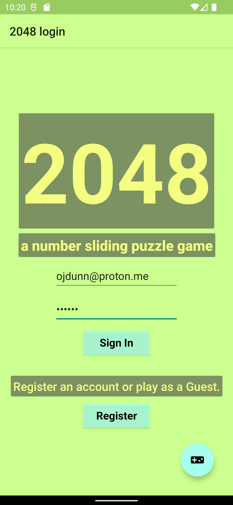
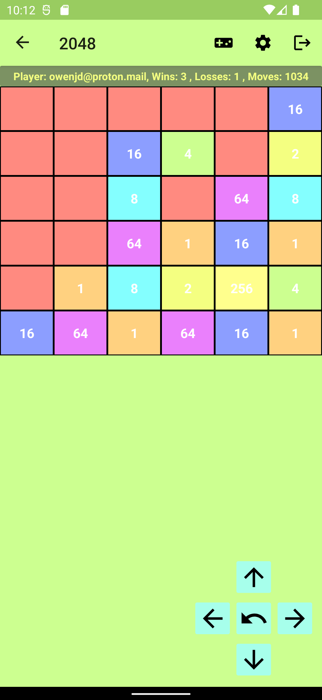
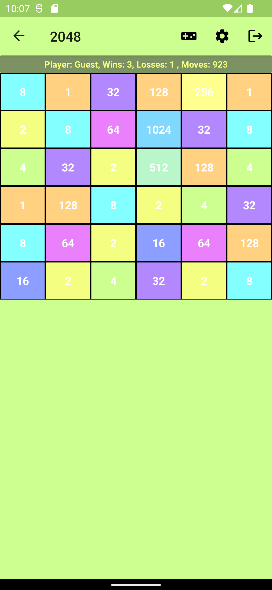

# 2048 Number Sliding Game for Android

A clone of the popular 2048 number sliding game. Move a grid of even numbers to reach a sum of 2048.

The game starts with a few random cells filled with even numbers. The player makes a move by sliding the board left, right, up, or down. The numbers will then slide the respective direction. If a number collides with an equal number, the two numbers will sum into one cell towards the direction chosen. With each move one new number will appear on a random cell. The game is over when no more moves can be taken because the board is full or a winning sum of 2048 has been made in any cell.

As games are played all user data is saved while the application is open. User data includes number of email, wins, losses, and total moves. It is displayed at the top of the game screen.

Use of API 32, supporting back to API 29, using Kotlin, Firebase backend.

The code itself is well documented as well.

## Links

[Android documentation](https://developer.android.com/reference)

[Kotlin documentation](https://kotlinlang.org/docs/getting-started.html)

[App Github Page](https://github.com/ojdunn/android-2048-game)

## Technology used

### Android

An Android app starts with a Linux process called Zygote. Zygote instantiates the Java Virtual Machine (JVM) running on Android Run Time (ART). When it spawns processes it passes along the JVM and core Android libraries. 

At launch, an app's manifest file is read by the Android runtime system to get information on the application class and main launcher activity. A new child process instantiates an `ActivityThread` object, which uses the `android.app.Application` application class by default (may use another via the manifest). An activity is instantiated after `ActivityThread` sends a request to the Activity manager. Once an activity starts it invokes the `OnCreate()` method.

A running app makes use of a callback function, usually of the `Activity` subclass `AppCompatActivity` today, to provide hooks for system events and other apps. The various callback methods have the *on* prefix such as `onCreate()`, `onResume()`, and `onStop()`.

While an app is running it can be in seven states. The most important states include (with their associated hook calls) Active (`onResume()`), Paused (`onPause()`), Stopped (`onStop()`), Restarted (`onRestart()` then `onResume()` called). Overriding these methods allows you to modify them. 

`onCreate()`, the first hook of the lifecycle of an Android app, can be overriden to allow the programmer to set the views, widgets, listeners, resources, and more.

When a new activity is started the sequence of hook calls is `onCreate(), onStart(), onResume()`. On a transition to a new activity with an intent call of `startActivity(intentName)` then `onPause(), onStop()` are called before the same start calls are made for the next activity. `onStop()` hides a screen. If the back button is pressed then `onDestroy()` is called after `onStop()`, forcing the activity to be recreated if it is ever accessed again. A stack data structure is used for activity transitions similar to function call stacks.

The `finish()` method of the `Activity` class allows you to terminate an activity and remove it from the activity stack. Use it to set transition behavior when moving back. Place within `onStop()` override?

The functions `onSaveInstanceState()` and `onRestoreInstanceState()` exist to restore a state after an interruption.

The manifest file `AndroidManifest.xml` defines the overall structure of the app. It includes the unique package name, permissions, themes, components, activity classes, and entry point.

#### User Interface of Android

Android supports programmatic and declarative user interface design. Declarative involves stating the geometric relationships of layout components. Android then uses the constraints to find the location and size for each component for a given phone. A layout tool editor allows you to drag and drop various components and set constraints. A corresponding XML file is created and can be edited to define constraints as well.

Layouts are set up with container classes (children of `ViewGroup`) that contain widget classes (children of `View`). For example, a ConstraintLayout with several `TextView` and `Button` widgets defined in place using constraints.

With the LinearLayout you can set the layout_weight attribute for all children to say how much of the screen they will fill (widgets and containers). When you do this the layout_height must be set to 0dp for vertical layout and layout_width set to 0dp for horizontal layout for this to work. You might also use a container layout class within this layout for more complex layouts.

Ideally you want to avoid setting anything but spatial relationships in layout XML files. The UI of Android allows you to set themes, styles, and widget specific attributes. 

A **theme** applies widely across the app and can be assigned to the whole application, activity (fragments too?), or group of widgets. Theme attributes are semantic to allow easy changing of specific attributes, such as colorPrimary. You would then assign a color by listing a color value from a color xml file. Use a theme by setting it in the manifest file with the `android:theme="@style/MyTheme"` attribute. Using a theme with any widget will set that theme for all the same widget types in the app.

**Styles** are normally assigned to a specific widget, such as a Button. They allow you to extract common attribute values, making the maintenance and change of attributes by groups of the same type easier. Style and themes both use the `<style>` tag in XML.

See Android Material Design to know what semantic color names of themes, etc., are used in specific places such as the status bar.

Both themes and styles allow inheritance.  This allows you to define common attributes at a parent theme or style, change just a few things, and have a theme/style for a certain Android version numbers with new features and allow older phones to use parent style attributes only.

You can change the appearance of a view based on its state. A pressed button changing its image background, for example.

There is an attribute hierarchy of what a final attribute value will be depending on how it was assigned. Make note of it when assigning attributes multiple ways if you get unexpected results.

`CoordinatorLayout` and its child classes can be used to produce advanced behavior such as buttons dissappearing while scrolling down and a View folding gradually up to nothing as you scroll down.

#### Handling data

`RecyclerView` is useful for displaying large amounts of data. Views are reused and put into a pool as data is fetched and discarded while scrolling. To show items in the list view you need to use the RecyclerView.Adaptor class. The adaptor uses the data source that is to be displayed in a certain way. Some other children classes of RecyclerView are also used for caching views (ViewHolder) and controlling the layout (LayoutManager) of the list items.

A number of backend services are available which privide authentication / user management, push notifications, datastore, social media integration, and app analytics through a SDK for Android. The SDKs often provide client-side APIs to services. The main benefits of backend as a service is the ability to scale easily, no need of your own server-side development, and speed of development. Some services are free until you reach a certain scale. The cons include dependence on a third party.

One backend service for developers is Google [Firebase](#Firebase). It is used for this project to handle user log in. It could also be used to store user data.

Another option is to create your own server-side management of the mentioned services. The pros include having full control to custimize it to fit your app exactly. The cons include cost (compare costs and anticipated costs with growth).

### Firebase

A mobile backend as a service (MBaaS), it provides user management, database storage in the cloud, and more.

You can use **Firestore** for a database. Firestore stores data as collections and documents. The documents are a little like a row but they are unstructured and require no template. A collection contains documents, but a document may hold a ref to a subcollection. The collection itself can't hold a direct ref to another collection. Finally, a document can't hold a ref to a subdoc.

To add Firebase to an app first add the needed SDK in the Gradle files, setup app connection on the Firebase website, add google-services.json file to app directory.

See Google documentation for different services such as Authentication, database.

#### Threads

A main thread is used for user interface. Other threads are used to fetch data, for example. This allows a user to continue using the app while data is loading. 

#### Libraries

You can use first and third-party libraries. With Gradle, third-party libraries are declared as compile-time and run-time dependent or runtime dependent only.

You may run into a conflict of library dependencies. This fix this, usually you would only use the latest version of a support library. Use the Gradle dependency tool to find out which library causes the conflict. Then you can exclude the older library dependency of a library similar to below:

```
implementation ('com.firebaseui:firebase-ui-storage:0.6.0', {
    exclude group: 'com.android.support', module: 'palette-v7'
    })
```

##### Architecture Components

This is part of the Jetpack bundle. It includes ways to improve adherence to MVC-like architectures (such as `livedata`, `databinding`, `room` libraries), app lifecycle (such as `lifecycle` library) management, running concurrent tasks in the background (such as `workmanager`), UI transitions (such as `navigation`).

##### navigation

This can be used to design an app with one Activity class consisting of a Fragment class for each screen/destination and a host Activity containing a navigation host fragment to control screen transitions. This project is implemented using this technique.

This library consists of a navigation graph xml file to define screen transitions and behavior while doing so. It handles the activity stack automatically, allows type safe argument passing between screens, and more.

The actions on the graph represent transitions between screens. They include some options to have desired behavior in the screen stack. The option *PopupTo* tells what screen to go to when the user hits back. The option *PopUpToInclusive* tells whether to pop the old instance of the destination screen when moving back. You may want to use this option when you have more than one action leading to the same screen.

It also has a navigation host fragment. This is a UI fragment that is added to a layout to swap screen destinations in and out of the current view.

Third, it has a navigation controller. This is a fragment object used with the navigation host fragment to tell the UI fragment what screen to load or unload.

##### ButterKnife

Allows data binding. This can be used to set up a Model-View-Viewmodel (MVVM).

### Kotlin

Developed by JetBrains and officially endorsed by Google for Android Development, Kotlin compiles into Java bytecode for use on a JVM. It also works with Java code within the same and other files of a compiled project. Any Java libraries supported by Android should work with Kotlin. In addition, old Java code can be translated to Kotlin by Android Studio. 

In this project, an old java implementation of the model of mine (part of MVC used for that project: [link](https://github.com/ojdunn/2048-game)) for 2048 was re-used. 

## Code plans

### Architecture

The goal is to follow an architecture to allow easier testing, changing of components, etc.. The more separation between the model, view, and controller the better. In this architecture the model handles logic and data, the view has communication with the model and controller, and the controller receives user actions from view and updates the model. Following this exactly with Android may be impossible.

The Android `Activity` class is used for handling events and updating the view. Some libraries exist to help with architecture. These include [Architecture Components](#Architecture Components) and [ButterKnife](#ButterKnife).

A **Model-View-Viewmodel (MVVM)** architecture may work best with Android. It was chosen for this project. In this setup a passive view binds data from the viewmodel, which holds UI data that is consumed by the view. In Android the view itself consists of the views and their controllers so it may be called a passive view, making it a good fit for this architecture. Data binding requires a library such as [ButterKnife](#ButterKnife). 


<br>*Figure 1: MVVM Diagram, an architecture well suited to Android; Source: Mobile Application Development, 2nd, Engelsma*

In the data binding process, the view subscribes to a data stream produced by the viewmodel. The view also displays data to the UI and captures user UI actions. The viewmodel does not need a reference to the view ("Observer" pattern) and it handles the UI data. Only the viewmodel has a reference to the model. The view is notified in this way of any data changes. 

The LiveData class allows this upward communication (View -> ViewModel -> Model) using the Observer pattern. In this pattern the View subscribes to the LiveData class to automatically update values in the UI.

The app is to consist of a welcome screen, a register account screen, an options screen, and a game screen. It is recommended by experts to use the Jetpack `navigation` library to create an app with one activity, a navigation graph, and a navigation controller to transition between screens. Each screen would be written as a single `Fragment` class hosted by a single `Activity` class. Fragments all have independent lifecycles like Activities and similar hook methods. Some additional hook methods of Fragments include onCreateView(), onAttach(), onDetach(), onDestroyView(). They use layout files like Activities.

Another option is to use a separate activity for each screen and changing between screens using the `Intent` class. This class also allows data to be sent between screens.

#### Model

The model handles application logic and data, notifies the viewmodel of changes, and receives updates from the viewmodel. The logic of the game is summarized [above](#2048-number-sliding-game-for-android). The data for the game board must be updated to the UI every turn. The viewmodel will get this data from the model component to allow the UI view to update through data binding.

#### ViewModel

The Jetpack `lifecycle` package includes a `ViewModel` class. This class uses the `LiveData` generic class (or Mutable prefix type) to handle data such as a user email and password. The different fragments (Views) can store and retrieve data from the viewmodel by having a reference to it. Activities and fragments must use the Jetpack factory class to access the viewmodel.

#### Passive view 

The title screen simply introduces the game and allows the user to sign in or start a game without signing in. 

The fit Android material design recommendations (see more on design section of Android docs) the options should be selected from the top app bar (the "action menu") and starting the game should be selected by a floating action button (FAB) as starting the game is the primary action.

The register screen allows a user to create a new account.

The options screen allows the player to choose various game options such as winning score, difficulty, and board size. The device running the game can only display a certain sized grid of squares (height, width) with readable numbers. The maximum size needs to be calculated based on the phone screen dimensions, if this is possible to do. Otherwise, a sensible range of game board sizes will be set. Auto-sizing, calculation, other must be done to make sure the UX fits the screen.

A range of 3 - 6 for the rows and columns should display and play a game properly within constraints for screen size, orientation of screen, text readibility, and android constraints. The game has trouble running if the number of views on screen reaches around 50. A solution to this is to create a single game board view or group of multiple cells per view instead of having each game cell be its own view.

The game screen itself features a grid of squares with numerical text. A FAB, directional swipes, or tilting motions might be used to control the game. I first implemented a direction pad with the four directions: left, right, up, and down to play. The other options might be added later.

The game board can be created using Android layouts and widgets. I used TextView widgets with TableLayout and TableRow layouts. TableLayout doesn't support borders, so a rectangle was drawn in each cell and a background color was set to better see the cell borders. You should be able to programmatically add rows and cells of TextView during the game to change board size for different screen sizes and custom player choice. It keeps track of each cell of TextView added to the board to change its text value as the game logic determines new cell values after each player move.

### Data

If data storage in the cloud is added to this project then if the player doesn't sign in local data would be used. If the player signs in remote data will overwrite local data. If the user is logged in, local data will be written remotely before the player exits the app. [Firebase](#Firebase) might be used for this purpose.

The Firestore database of Firebase will be used. At the top level, a collection of users (documents of the user's collection) with one unique user ID per document to locate each user. The user ID is returned by Firebase Authentication after a user is created and can be found in the users section of Authentication.

Registering an account will allow users to save their credentials to the cloud to allow the storage of their game data remotely. A game like this likely wouldn't need cloud storage unless connected to cloud game services, such as Google Play.

## Code overview

The Jetpack library [navigation](#navigation) is used with a navigation controller, navigation graph xml, an navigation host fragment. A single navigation activity and its layout xml hosts different layouts, which are themselves managed through their respective layout xml and fragment class files. The navigation graph defines the activity stack behavior and allows type safe passing of data by bundling it in navigation controller **navigate** function calls.

The navigation controller is found and used to navigation to the appropriate fragment layout depending on what button is pressed and if valid data is provided.

The app launches with the NavigationActivity class hosting the LoginFragment class. This fragment allows a user to login with an existing account (no storage of user data yet) to play the game. The user can also play as a guest with no account by hitting the floating action button without entering user data. 


<br>*Figure 2: Login Screen; An on screen keyboard allows a user to enter their username and password.*

The different buttons of LoginFragment have actions that are set with OnClickListener lambda functions (as the OnClickListener interface only has one method). These functions pass a View object reference (parent class of many widgets including the button) to the defined function code, but you don't have to use it.

The login button runs some code to check if the email and password are valid. A regular expression `java.util.regex.Pattern` object is used to check for a valid email pattern. This object has a matcher method to test a passed string reference against a compiled pattern.

If the user has been registered before (explained below) then they will log into the game through Firebase.

The main game button, as a floating action button, allows the user to play as a guest or with login details if they are filled in first.

A register button allows the user to change to the register fragment (`RegisterFragment`) layout. This allows the player to register an email and password with Firebase.

A passive view consists of the views and their controllers. As the user uses buttons, swipes a direction, etc., listeners take action to signal model (as a game logic object) to move the numbers a direction using the game logic. 


<br>*Figure 3: Main Screen; A game board and direction pad of four direction buttons and an undo button allow the user to play. A toolbar at the top allows player to start a new game, choose options, or logout and quit the game.*

In addition to the direction buttons, a center undo button is present to allow to player to go back any amount of moves up to the start of the current game. This is handled with a stack. The stack holds an ArrayList<Cell2048> of all non-empty cells. Non-empty means a non-zero value for the cell. The cells contain the position on the board (row, column) and the value. No action will be taken and a message will be displayed if the user tries to move past the starting move.


<br>*Figure 4: Main Screen when undo is used; The undo button allows the user to go back one move.*

After each move, a call is made to check the game status. The status is an enum class that includes "IN_PROGRESS, USER_WON, and USER_LOST". 

Depending on the status of the game, more moves will be allowed, a game won message will be displayed, or a game lost message will be displayed.


<br>*Figure 5: The game ending with a loss are there are no more possible moves. The direction and undo keys have been disabled until a new game is started.*

It the game has ended with a win or loss, then no more moves will be allowed and the user can start a new game or log out of their account and quit.

As the player plays games, all user data is saved and displayed on the game screen. The [ViewModel](#ViewModel) class is used to access and store data across fragments and different games.

## Goals for this project

- [x] A playable game with basic graphics.
- [x] Record user statistics to display in a UI and potentially save across play sessions.
- [x] Allow user accounts and cloud storage. (Firebase access currently down)
- [ ] Store user data in the cloud
- [ ] Allow user to choose and set several different play options: board size, winning score, etc.
- [ ] Based on the phones screen size, determine the range of permitted number grid x and y axes. 
- [ ] Improve presentation: more attractive visuals, sounds, color, vectors, etc.